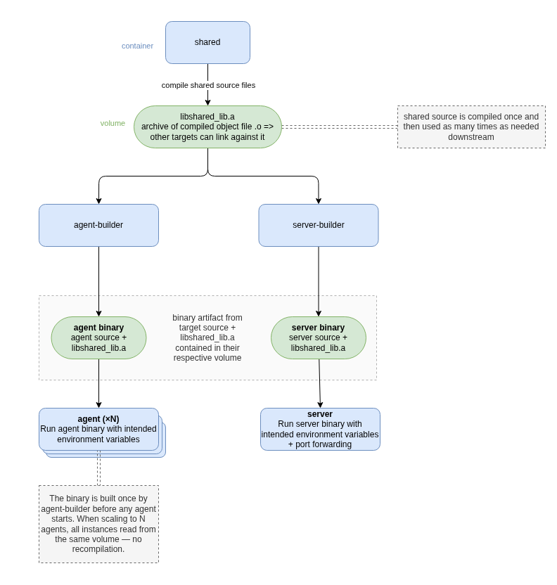

# Inferno
## Project description

Inferno is a distributed remote monitoring and diagnostics platform built in C++.

Originally derived from an academic specification focused on progressively complex networking and system programming challenges, the project has been fully reframed into a legitimate monitoring and orchestration platform.

The project is composed of:
- a central server responsible for orchestration and analysis,
- remote agents deployed on monitored machines,
- and a future Qt desktop client for visualization and control.

The system focuses on:
- low-level network communication,
- custom binary protocol design,
- cross-platform system monitoring,
- and distributed telemetry processing.

Agents communicate with the server through a custom binary protocol and are designed to collect system information, stream performance metrics, execute diagnostics, and report machine health data.

The project focuses on low-level networking, protocol design, systems programming, telemetry collection, and cross-platform development.

## Current status

The project is structured into progressive implementation phases inspired by system design milestones.

Current progress:

- Phase 1: Network communication layer (server ↔ multiple agents)
  - implemented using custom socket abstraction (`ISocket`)
  - supports concurrent connections without threads or fork

- Phase 2: Binary communication protocol design
  - custom packet format (`lptf_protocol`, `protocol_parser`, `protocol_serializer`)
  - extensible structure for future telemetry and commands
  - RFC-style specification in progress

Next steps:

- Phase 3: System metrics collection and diagnostics agent
- Phase 4: Qt-based monitoring GUI
- Phase 5+: persistence, analysis, cross-platform deployment

## Planned architecture
Inferno is designed as a distributed monitoring system composed of three main components:

### Agent (remote node)
A lightweight system daemon responsible for:
- collecting machine metrics,
- executing diagnostic commands,
- streaming telemetry to the server,
- maintaining persistent connection with automatic reconnection.

### Server (central coordinator)
A central service responsible for:
- managing multiple connected agents,
- receiving and parsing telemetry streams,
- coordinating requests and responses,
- preparing data for visualization and analysis.

### Desktop client (future)
A Qt-based interface providing:
- real-time monitoring dashboard,
- agent management interface,
- visualization of system metrics and diagnostics.

## Features

### Current
- Custom binary communication protocol
- Multi-agent server architecture
- Shared C++ networking library
- Docker-based development pipeline
- Automated test execution during builds
- Multi-agent scaling support via Docker Compose

### Planned
- Continuous metrics streaming
- Remote diagnostics execution
- Cross-platform monitoring agent
- Qt desktop monitoring interface
- PostgreSQL data persistence
- Health analysis and anomaly detection
- Agent reconnection resilience
- Background daemon/service deployment

## Tech stack

| Layer | Technology |
|---|---|
| Backend | C++17 |
| Build system | CMake |
| Containerization | Docker & Docker Compose |
| Testing | Google Test |
| Database (planned) | PostgreSQL |
| Desktop client (planned) | Qt 6 |

## Prerequisites

- Docker / Docker Desktop installed and running

## Setup

Copy `.env.template` to `.env` and adjust values if needed.

```bash
cp .env.template .env
```
## Quick start 

This project uses Docker Compose profiles (`agent` and `server`) to separate build/runtime pipelines and keep logs readable.

`COMPOSE_PROFILES=agent,server` in `.env` allows `docker compose up` and `docker compose down` to work without specifying profiles manually.
### Start all services (agent + server)
```
docker compose up
```
### Start only agents
```
docker compose --profile agent up
```
### Scale agents
```
docker compose --profile agent up --scale agent=N
```
> replace N with the actual number you need
### Start only server
```
docker compose --profile server up
```
### Stop all services
```
docker compose down
```
> add the `-v` flag to remove build volumes and start from scratch


## How to build
This project uses a multi-stage build pipeline orchestrated with Docker Compose services.

Builder services are only responsible for compilation and testing.
Runtime services only execute the final binaries produced during the build pipeline.

The first service, `shared`, builds the shared static library (`.a`) inside a dedicated Docker volume.
`shared` tests are executed before the service exits. If any shared test fails, the pipeline stops and dependent services are not started.

The second service (`agent-builder` or `server-builder`) compiles the final target binary using the shared `.a` artifact from the common volume. The compiled target binary is stored in another dedicated volume. Like the `shared` service, target tests are executed before the service exits.

Build artifacts are stored in Docker named volumes (`shared-build`, `server-build`, `agent-build`) so rebuilds can reuse previous outputs. Use `docker compose down -v` to remove these volumes and start from scratch.

Finally, the runtime service starts the compiled target binary directly from its build volume.

Multiple runtime instances can be started without rebuilding the binary, since all instances use the same compiled artifact.


The following diagram illustrates the pipeline:


  'build_pipeline_&_artifact_flow.png'