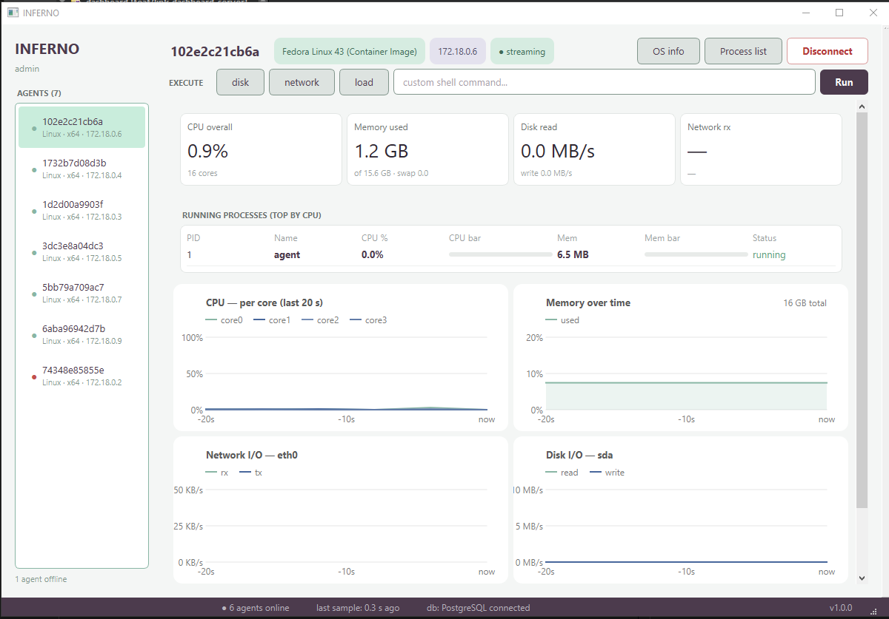
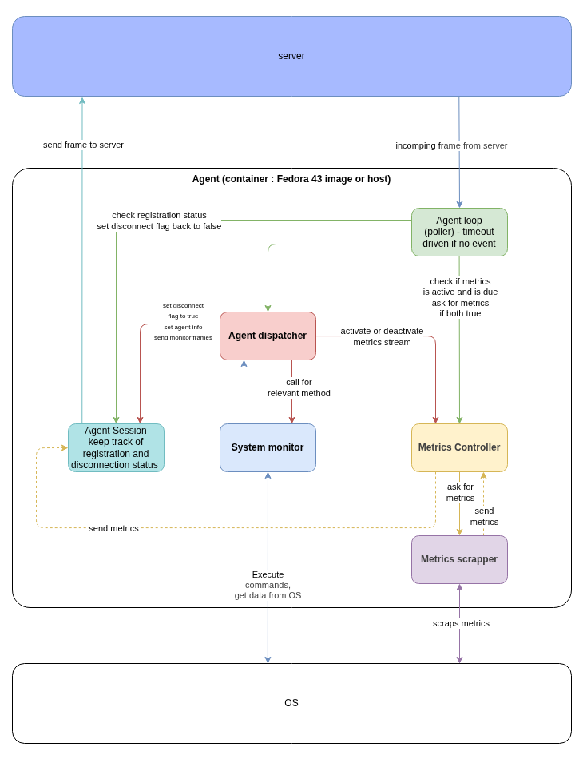
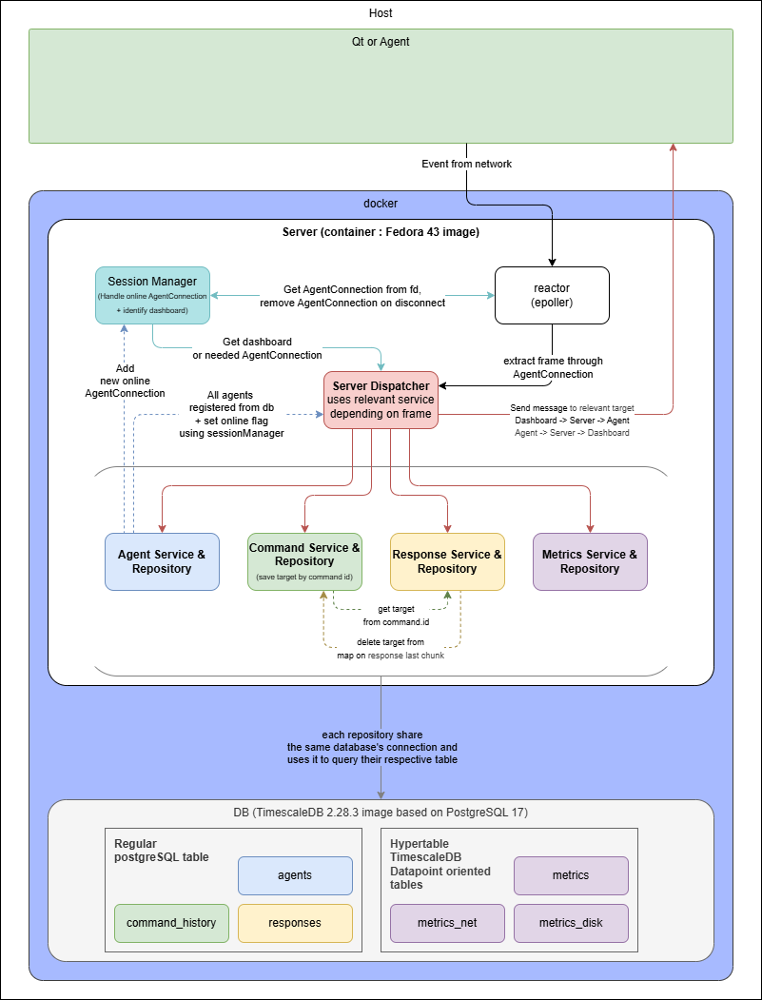
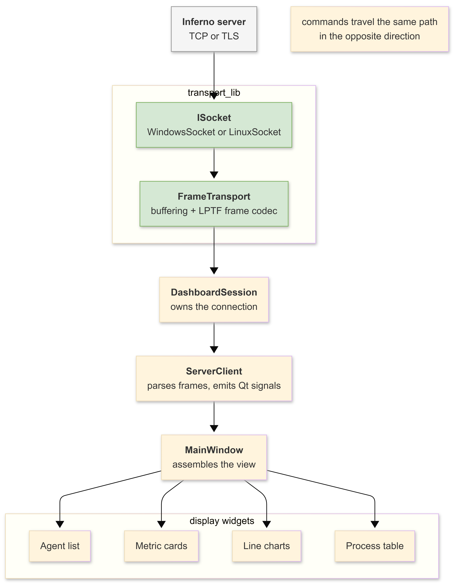

# Inferno



## 📋 Table of Contents
[test](#dashboard-on-Windows)

- [Communication protocol](./_docs/project/lptf_binary_protocol.md)
- [Architecture](#architecture)
  - [Agent's architecture](#agent-remote-node)
  - [Server's architecture](#server-central-coordinator)
  - [Dashboard's architecture](#desktop-dashboard)
- [Protocol message sequence diagrams](./_docs/protocol/README.md)
- [Binary protocol specification](./_docs/project/lptf_binary_protocol.md)
- [Features](#features)
- [Tech Stack](#tech-stack)
- [Dependencies](#dependencies)
- [Project structure](#project-structure)
- [Quick start](#quick-start)
- [How are agent and server built](#how-are-agent-and-server-built)
- [How to build dashboard](how-to-build-dashboard)
  - [Windows](#dashboard-on-windows) + [troubleshooting](./_docs/project/windows-troubleshooting.md)
  - [Linux](#dashboard-on-linux)

---

## Project description

Inferno is a distributed remote monitoring and diagnostics platform built in C++.

Originally derived from an academic specification focused on progressively complex networking and system programming challenges, the project has been fully reframed into a legitimate monitoring and orchestration platform.

The project is composed of:

- a central server responsible for orchestration and analysis,
- remote agents deployed on monitored machines,
- and a Qt desktop dashboard for visualization and control.

The system focuses on:

- low-level network communication,
- custom binary protocol design,
- cross-platform system monitoring,
- and distributed telemetry processing.

## Architecture

Inferno is designed as a distributed monitoring system composed of three main components:

### Agent (remote node)

A lightweight system daemon responsible for:

- collecting machine metrics,
- executing diagnostic commands,
- streaming telemetry to the server,
- maintaining persistent connection with automatic reconnection.



[Read more about agent achitecture](./_docs/agent/)

### Server (central coordinator)

A central service responsible for:

- managing multiple connected agents,
- receiving and parsing telemetry streams,
- coordinating requests and responses,



[Read more about server achitecture](./_docs/server/)

### Desktop dashboard

A Qt Widgets interface providing:

- real-time monitoring of one agent at a time (CPU, memory, disk, network),
- live charts built from a sliding window of the last 20 samples,
- agent list with connection state, and remote disconnection,
- remote command execution with output display,
- running process table and OS information on demand.

**Dashboard architecture**


[Read more about dashboard architecture](./_docs/dashboard/)

## Features

- Custom binary communication protocol
- Shared C++ networking library : `transport_lib`
- TLS or plain TCP transport, selected from the environment

#### Dashboard

- Qt desktop monitoring interface
- Continuous metrics streaming reception and display

#### Server

- Multi-agent server architecture
- TimescaleDB data persistence

#### Agent

- Agent reconnection resilience
- Continuous metrics streaming emission
- Cross-platform monitoring agent

#### Setup and automatisation

- Docker-based development pipeline
- Automated test execution during builds
- Multi-agent scaling support via Docker Compose

#### Future

- Remote diagnostics execution
- Health analysis and anomaly detection
- Background daemon/service deployment

---

## Tech Stack

| Layer            | Technology                                           |
| ---------------- | ---------------------------------------------------- |
| Containerization | Docker & Docker Compose (Agent & Server build)       |
| Server runtime   | fedora:43                                            |
| Server & agent   | C++20 , CMake 3.20 minimum                           |
| Dashboard        | Qt 6.4.2 minimum, 6.10.2 recommended (Widgets + ?? ) |
| Database         | PostgreSQL 17.10 / TimescaleDB 2.28.3                |
| Tests            | Google Test                                          |

---

## Dependencies

All **server-side and agent-side dependencies** are handled automatically inside the Docker container (using `fedora:43` image) — nothing to install on your machine for the server.

All **dashboard-side dependencies** need to be installed on your host machine (see [How to build dashboard](#how-to-build-dashboard) below).

| Library            | Version            | Where                  | Purpose                                                                              |
| ------------------ | ------------------ | ---------------------- | ------------------------------------------------------------------------------------ |
| Google Test / Mock | 1.15.2-4           | Agent, Server (Docker) | Unit testing framework                                                               |
| CMake              | 3.31.11 (3.20 min) | Dashboard (host)       | Build system for the Qt client                                                       |
| openssl-devel      | 3.5.7-2            | All (Docker & host)    | Secure communication on network                                                      |
| OpenSSL            | 3.2.4              | Dashboard (host)       | OpenSSL headers + libraries compatible with mingw64 toolchain for TLS/SSL            |
| libpq              | 18.0-3             | Server (Docker)        | Low-level C library to connect and send queries to PostgreSQL                        |
| libpqxx            | 7.10.5-1           | Server (Docker)        | Official C++ wrapper over libpq — this is what the server code uses directly         |
| postgresql         | 18.3-2             | Server (Docker)        | PostgreSQL client tools (psql, pg_isready) — used for debugging inside the container |

**Note:** The server code links against PostgreSQL 18.3-2 client libraries (libpq/libpqxx), which are backwards-compatible with the PostgreSQL 17.10 database server running in the TimescaleDB container.

---

## Project structure

```
Inferno
  ├── 📁 _docs
  ├── 📁 agent
  ├── 📁 certs
  ├── 📁 dashboard
  ├── 📁 server
  ├── 📁 test_support
  ├── 📁 transport
  ├── ⚙️ .env.template
  ├── 📄 CMakeLists.txt
  ├── 📄 Dockerfile.backend
  ├── 📄 Dockerfile.server
  ├── 📄 LICENSE
  ├── 📝 README.md
  ├── ⚙️ docker-compose.yml
  ├── 📄 inferno.sh
  └── 📄 init.sql
```

### Key folder

- `_docs` is the folder where focused documentation is stored
- `transport` is a custom library producing a `transport_lib.a` that `agent`, `server` and `dashboard` link against. It defines ISocket for crossplatform socket handling and the binary protocol (structures, codec) (see [Transport](./_docs/project/))
- `test_support` is a header only custom library that generates fake data for test fixtures and shared stubs
- `agent`, `server` and `dashboard` produces executable

### Key Files

- `.env.template` needed to create your own .env (see [Setup](#setup))
- `inferno.sh` is the script used by docker-compose to launch test automatically (see [How are agent and server built](#how-are-agent-and-server-built))
- `init.sql` is the database schema used at first run for initialize database through docker-compose

---

## Prerequisites

### All Platforms (Docker)

Docker / Docker Desktop or [Podman](https://github.com/containers/podman) installed and running
For server and agent: Docker/Podman handles all dependencies automatically.

### Windows (Qt)

- Qt installed (see more on [How to build dashboard](#how-to-build-dashboard))
- OpenSSL from Mingw64 environment (see more on [Install OpenSSL compatible with Qt MinGW](#install-openSSL-compatible-with-qt-mingw))

#### ⚠️ CRITICAL: Consistent Toolchain Required

**All compiled code must use the same MinGW version.** Mixing toolchains (e.g., ucrt64 + mingw64 + Qt's MinGW) causes segmentation faults.

**You MUST use:**

- **GCC:** Qt's bundled MinGW (not MSYS2, not Git Bash mingw64)
- **OpenSSL:** Compiled for the same MinGW version

---

## Setup

Copy `.env.template` to `.env` and adjust values if needed.

```bash
cp .env.template .env
```

### Key variables to know:

| Variable            | Default            | Required | Description                                                                                             |
| ------------------- | ------------------ | -------- | ------------------------------------------------------------------------------------------------------- |
| `POSTGRES_PASSWORD` | —                  | ✅       | Root password for the TimescaleDb container. Only used internally by PostgreSQL, not by the server.     |
| `POSTGRES_DB`       | `infernoDB`        | ✅       | Name of the database that will be created and used by the server.                                       |
| `POSTGRES_USER`     | `infernoUser`      | ✅       | PostgreSQL user the server connects as.                                                                 |
| `DB_PORT`           | `5432`             | ✅       | PostgreSQL port exposed on your host. Change it if you already have a local PostgreSQL running on 5432. |
| `SERVER_PORT`       | `8888`             | ✅       | Port the C++ server listens on (also exposed by Docker).                                                |
| `COMPOSE_PROFILES`  | `agent,server, db` | —        | Needed for development stage to enable --profile command and orchestration through docker compose.      |
| `TLS`               | `true`             | —        | Used as configuration for disabling TLS, if non existant, default will be true.                          |

> ⚠️ All three `POSTGRES_*` variables must be set or the database container will fail to start — and since the server depends on it, it will fail too.

## Quick start

This project uses Docker Compose profiles (`agent`, `server` and `db`) to separate build/runtime pipelines and keep logs readable.

`COMPOSE_PROFILES=agent,server,db` in `.env` allows `docker compose up` and `docker compose down` to work without specifying profiles manually.

### Start all services (agent + server)

```
docker compose up
```

### Start only agents

```
docker compose --profile agent up
```

### Scale agents

```
docker compose --profile agent up --scale agent=N
```

> replace N with the actual number you need

### Start only server

#### Build & start

```
docker compose --profile server up
```

#### Start only database (timescaleDB)

```
docker compose --profile db up -d
```

> -d = detached, run in background

### Stop all services

```
docker compose down
```

> add the `-v` flag to remove build volumes and start from scratch

---

## How are agent and server built

This project uses a **multi-stage container build pipeline** orchestrated through Docker Compose-compatible services. The pipeline has been tested with both Docker and Podman.

Builder services are only responsible for compilation and testing.
Runtime services only execute the final binaries produced during the build pipeline.

The first service, `transport`, builds the transport static library (`.a`) inside a dedicated Docker volume.
`transport` tests are executed before the service exits. If any transport test fails, the pipeline stops and dependent services are not started.

The second service (`agent-builder` or `server-builder`) compiles the final target binary using the shared `.a` artifact from the common volume. The compiled target binary is stored in another dedicated volume. Like the `transport` service, target tests are executed before the service exits.

Build artifacts are stored in Docker named volumes (`transport-build`, `server-build`, `agent-build`) so rebuilds can reuse previous outputs. Use `docker compose down -v` to remove these volumes and start from scratch.

Finally, the runtime service starts the compiled target binary directly from its build volume.

Multiple runtime instances can be started without rebuilding the binary, since all instances use the same compiled artifact.

The following diagram illustrates the pipeline:


## How to build dashboard

### Dashboard on Windows

First, check if you already have the required tools:

```bash
qmake6 --version && cmake --version && openssl --version
```

If anything is missing, you have two options:

#### Install Qt 6.4.2+ with MinGW

**Option A — via WSL (Windows Subsystem for Linux):**

```bash
sudo apt install qt6-base-dev qt6-base-dev-tools
sudo apt install cmake
sudo apt install qt6-websockets-dev
```

**Option B — via the Qt official installer:**

Download Qt from [https://www.qt.io/download-open-source](https://www.qt.io/download-open-source) (free community version, account required).
Install `Qt` with `gcc`, `g++` and `cmake` to avoid path issues.
Qt **6.4.2 minimum**, **6.10.2** was used for development.

**During installation, select:**

- Qt 6.10.2 (or 6.4.2+)
- **MinGW 13.1 64-bit** compiler

Then add these to your `PATH`:

```
C:\Qt\Tools\QtCreator\bin
C:\Qt\6.x.x\mingw_64\bin
C:\Qt\Tools\CMake_64\bin
```

Verify installation:

```powershell
where gcc
# Should show: C:\Qt\Tools\mingw1310_64\bin\gcc.exe

where cmake
# Should show: C:\Qt\Tools\CMake_64\bin\cmake.exe

```

#### Install OpenSSL compatible with Qt MinGW

Install **MSYS2** (a separate tool, independent from Qt) from: https://www.msys2.org/
Open **MSYS2 MinGW 64-bit terminal** (NOT UCRT64, NOT CLANG64):

```bash
pacman -S mingw-w64-x86_64-openssl
```

Verify OpenSSL libraries exist:

```bash
ls -la /mingw64/lib/libssl.dll.a
ls -la /mingw64/lib/libcrypto.dll.a
ls -la /mingw64/include/openssl/ssl.h
```

**Build the dashboard:**

From **PowerShell**:

```powershell
./dashboard/windows-build.bat
```

From **Git Bash**:

#### Release

```bash
powershell.exe -NoProfile -Command "& '$(cygpath -w ./dashboard/windows-build.bat)'"
```

**Run the dashboard:**

```bash
./dashboard/build/dashboard.exe
```

> **WSL:** if you get EGL/MESA errors, add `export LIBGL_ALWAYS_SOFTWARE=1` to your `~/.bashrc`

---

### Dashboard on Linux

Check your tools first:

```bash
qmake6 --version && cmake --version
```

Install if needed:

```bash
sudo apt install qt6-base-dev qt6-base-dev-tools
sudo apt install cmake
sudo apt install qt6-websockets-dev
sudo apt install libssl-dev
```

Make the scripts executable (only needed once):

```bash
chmod +x ./dashboard/linux-build.sh
chmod +x ./dashboard/run.sh
```

Build then run:

```bash
./dashboard/linux-build.sh
./dashboard/run.sh
```

**WSL only:** if you get EGL/MESA rendering errors, add this to your `~/.bashrc` and restart your terminal:

```bash
export LIBGL_ALWAYS_SOFTWARE=1
```

> WSL has no GPU access, so Qt's hardware OpenGL rendering fails. This flag forces software rendering instead.

---

### Agent on Windows

Prerequisites: Same as Dashboard. Ensure OpenSSL is installed (see [Install OpenSSL compatible with Qt MinGW](#install-openssl-compatible-with-qt-mingw)).

**Build the agent:**

From **PowerShell**:

```powershell
./agent/windows-build.bat
```

From **Git Bash**:

```bash
powershell.exe -NoProfile -Command "& '$(cygpath -w ./agent/windows-build.bat)'"
```

**Run the agent:**

```bash
./agent/build/bin/agent.exe
```

---

## How to test db

Get inside inferno-db container

```bash
docker compose --profile db exec inferno-db   sh -c 'psql -U "$POSTGRES_USER" -d "$POSTGRES_DB"'
```

Or create a `queries.sql` at root project

```bash
touch queries.sql
```

Execute command inside container with

```bash
docker compose --profile db exec inferno-db sh -c 'psql -U "$POSTGRES_USER" -d "$POSTGRES_DB" -f /queries.sql'
```
